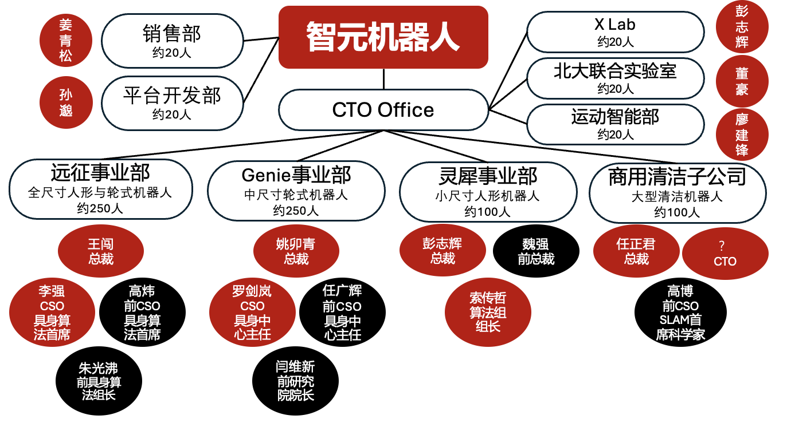

智元机器人以63%的持股比例与上纬新材形成深度关联，而智元内部各事业部负责人的经历与近期动态，更为这一关联增添了不少值得关注的细节，其背后的潜在影响值得探究。​

彭志辉原为远征事业部总裁，后来回归CTO办公室成立X-Lab。现远征事业部的总裁王闯，身上始终笼罩着一层争议的薄雾。曾有知乎用户提及他因信息安全问题离开前司，尽管该说法的真实性尚未有定论，但这一传闻始终未完全消散。不过，传闻在智元年中的大会上，王闯获得了高度表扬，其带领的事业部也被预计可能成为全年营收最高的部门。王闯并非等闲之辈，2017年他加入大疆激光雷达创始团队，后来还在安克创新旗下的马赫创新担任CTO，有着丰富的硬件量产经验，同事们评价他行事果断，对下属信任且放权。在邓泰华推动研发部门架构改革，要求各事业部自负盈亏的背景下，王闯带领的远征事业部被寄予厚望。

值得注意的是，远征事业部并非一片顺遂，该部门的朱光沸选择离开，据了解是因公司战略选择出现偏差，不仅选择了诸多不靠谱的落地方向，且未能提供可靠的机器人硬件，导致产品根本无法出货。这一情况从侧面反映出事业部在发展过程中面临的挑战。此外，前首席科学家高炜，有着亮眼的履历，本科毕业于清华，博士毕业于麻省理工，且在梅卡曼德有多年工作经历，但加入智元仅一个月便选择离职。据知情人士透露，高炜的技术方案比较保守，与智元激进的发展模式不相适配。取而代之的是李强，传闻是某车企自动驾驶大佬，接手远征具身算法部后成功将算法和本体深度打磨落地，最近获得了富临精工数千万订单。
灵犀事业部前总裁魏强的离职，为这一关联增添了更多变数。魏强入职时，灵犀X2产品已处于研发中期，但他对产品的理念与现有方向存在差异。魏强在行业内履历丰富，曾在松下、京东、华为等公司任职，开发过松下中国首款高清机顶盒、京东叮咚音箱等多款爆款产品，同事们评价他是“踏踏实实想做好产品的人”，且在产品理念上有着自己的坚持。这种理念上的分歧，可能给团队协作带来了一些挑战，进而可能影响了灵犀系列产品的推进节奏。如今魏强已离职，由彭志辉轮值灵犀事业部总裁。

Genie事业部的姚卯青，其职场路径充满了戏剧性。最初是闫维新的下属。入职智元后，他较快地招募了不少前蔚来的同事，之后研究院更名为Genie事业部。据其蔚来前同事介绍，姚卯青在之前的公司较为擅长向上沟通与处理内部斗争，但由于蔚来上级深谙技术，他最终被迫离开。离开蔚来来到智元后，他推广的数据采集产品初期取得了一定成效，与智元注重销售的风格相契合，但该商业模式的效果逐渐减弱，巨额投入的科研成果又存在口碑问题，有人认为“今年对Genie事业部来说是个重要考验”。

Genie前具身中心主任任广辉相对较少出现在公众视野中，但他并非默默无闻。据悉，他是智元技术领域的核心人物，不过上半年任广辉已从智元离职，这一变动是否会影响智元的技术研发进程。​取而代之的是罗剑岚，其发展轨迹也充满了戏剧性，从武汉理工汽车学院毕业到UC伯克利博士毕业，罗剑岚在智元的半年时间里，使用了较多经费进行科研工作，引发了一些讨论。他原本计划通过这些科研成果申请高校助理教授职位，不过暂未成功，坊间对此有不同猜测，有认为可能与他过往成果的归属有关，有的则推测可能涉及个人风评问题，相关讨论在国外学生论坛也能看到。

智元的商用清洁事业部也有着一段特别的发展历程。它是2023年智元刚成立时的第一个事业部，公司最初希望通过它来实现创收。然而，随着后来其他事业部发展势头越来越好，商用清洁事业部便独立为子公司了。曾担任智元首席科学家的高博，是清华SLAM领域的大佬，拥有深厚的技术功底和丰富的行业经验。但他后来选择离开智元，加入了另一家创业公司。

此外，智元的实际掌控人邓泰华，曾任华为ICT产品与解决方案总裁，还是彭志辉的校友。去年10月，他突然决定改革研发部门组织结构，将中台部门变为按产品线划分的事业部架构，这一改革，似乎与他推动智元收购上纬新材股份的动作有着某种联系。

市场传闻上纬新材将由邓泰华身边的亲信控制，然后逐渐并购智元的优质事业部。也有传闻智元会优先寻求去港股独立上市，不成功再陆续将事业部并入上纬新材。随着融资难度加大以及港股变冷，后续发展值得持续关注。智元内部这些负责人的经历与动态，如同一个个细微的节点，虽然看似独立，却可能在智元与上纬新材的关联中，通过影响智元的战略决策、资源分配、运营节奏等方面，产生各种潜在的联系与影响。

